# hERG-Simulation-Analysis

**Analysis script for ion conduction or drug flooding simulation of the hERG channel**

**Automatically plot the following data:**
1. Changes in filter diameters (based on CA or O distances)
2. Changes in pore diameters (based on CA or O distances)
3. Symmetry of filter
4. Symmetry of pore
5. Phi/Psi/Chi1/Chi2 angles of filter and pore residues
6. Numbers of water in filter and pore
7. Ion movement in the filter
8. Drug movement in the pore

**Requirements:**

Python3, VMD

**Usage:**
1. Place **simulation_analysis.py** and **aux_scripts** in a directory containing 1 protein structure file and 1 simulation trajectory file.
2. Run this script (Python 3):
  ```
  python3 simulation_analysis.py  -p [protein structure file (default = .psf in current dir)]
                                  -d [simulation trajectory file (default = .dcd in current dir)]
                                  -t [total simulation time of the whole trajectory (default = 1000)]
  ```
  Optional arguments:
  ```
                                  --drug [optional, set to the segname of the drug to analyze drug movement in the pore. If not set, the script will analyze ion movement in the filter by default]
                                  -e [analyze the simulation to this frame (default = -1 i.e. all)]
                                  -s [step to analyze trajectory file (default = 1 i.e. every frame accounted for, no skipping)
                                  -x [x label (default='Time (ns)')]
                                  --split [split each plot into # of smaller plots covering different time periods (default = 1 i.e. do not split)]
                                  --skipcommand [skip running VMD commands to generate input data, change if there is no need to calculate data again (default=True)]
                                  --labelsize [label size (default=20)]
  ```

**Examples:**

In a folder containing one .psf file, one .dcd file, and analysis scripts of a 1000 ns long ion conduction simulation: 
_python3 simulation_analysis.py -t 1000_

In a folder containing one .psf file, one .dcd file, and analysis scripts of a 3000 ns long drug flooding simulation. The user wants to split each plot into three smaller plots covering different time periods: 
_python3 simulation_analysis.py -t 3000 --drug HETB --split 3_

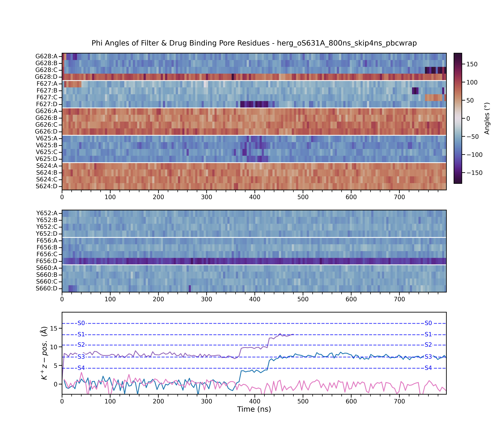
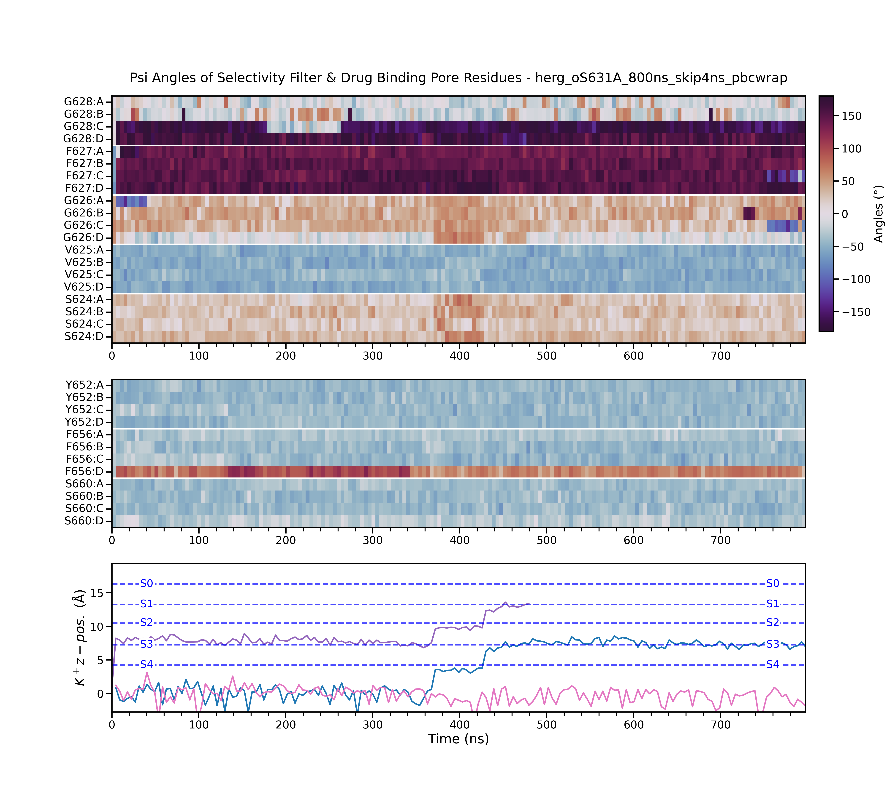
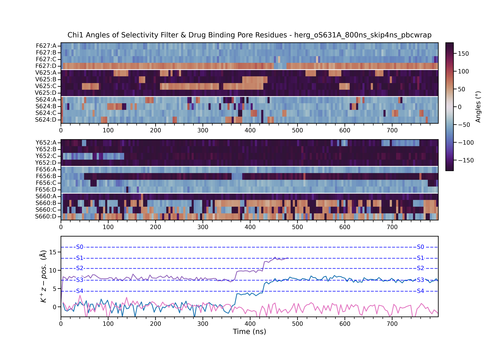
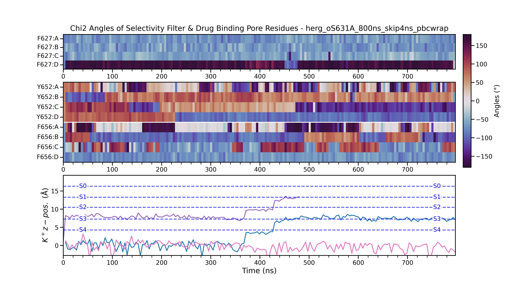
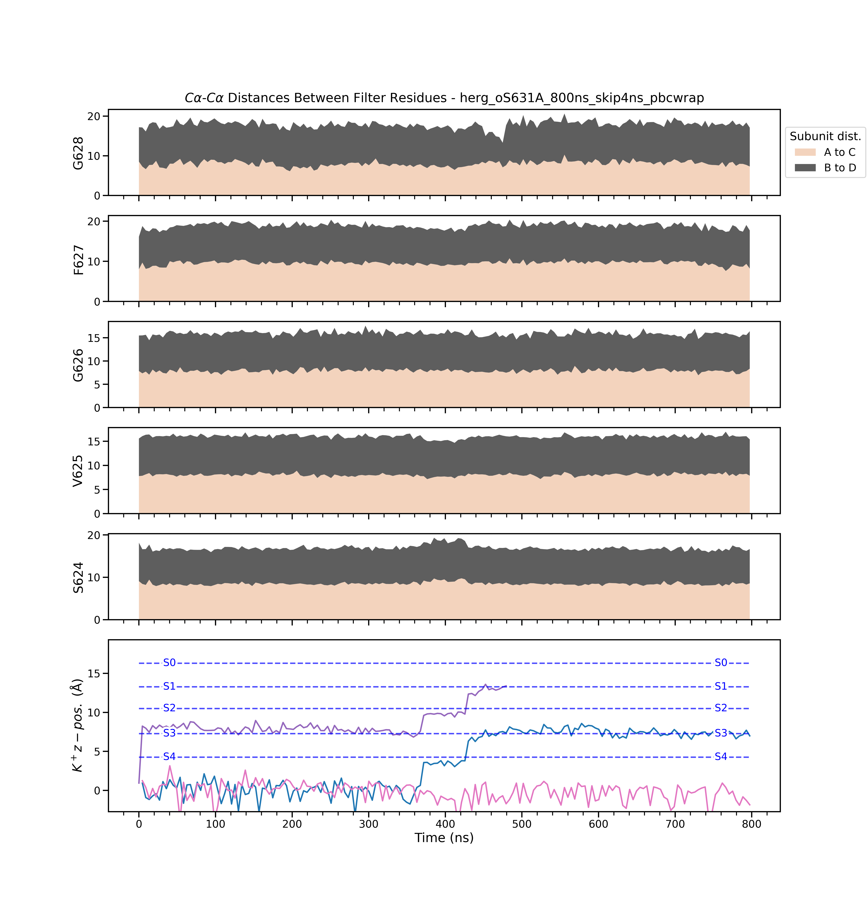
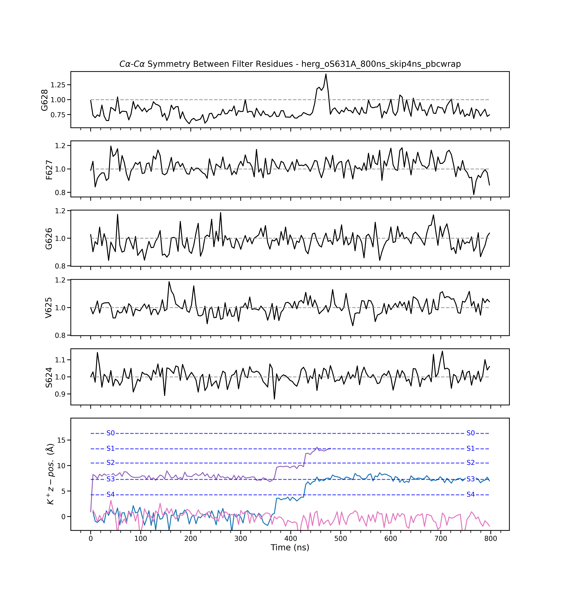
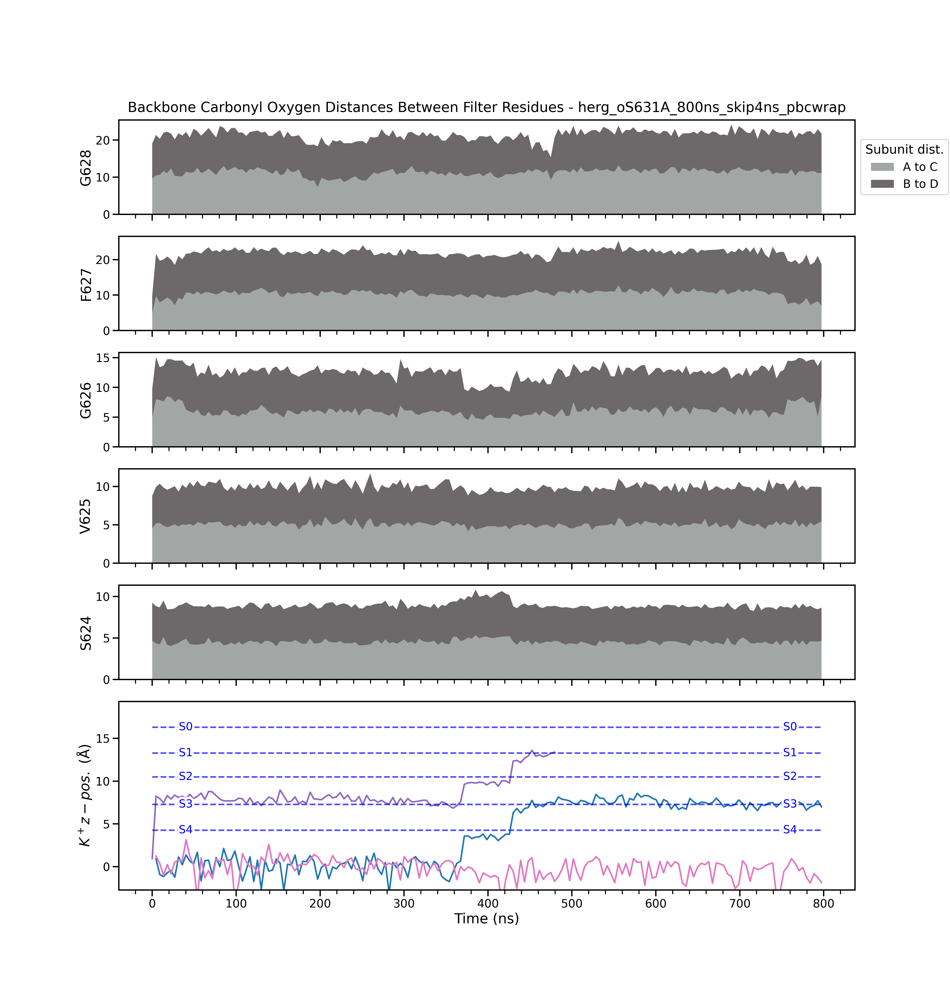
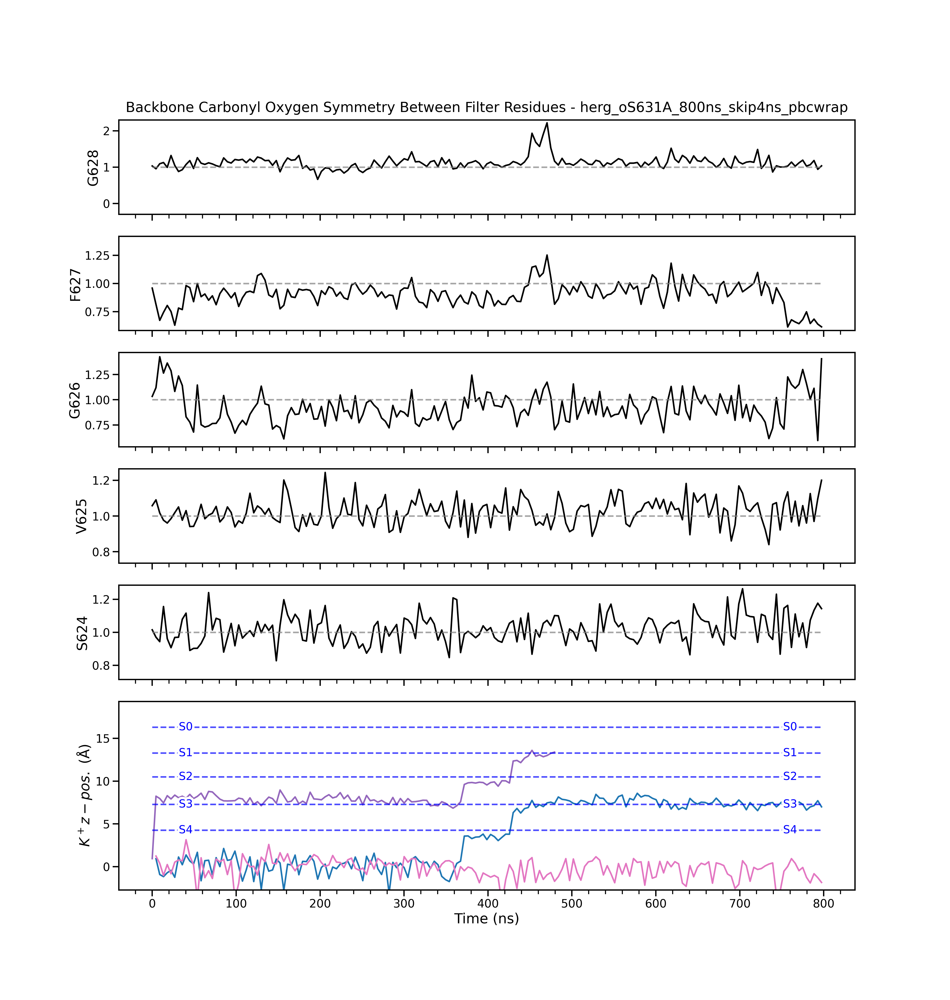
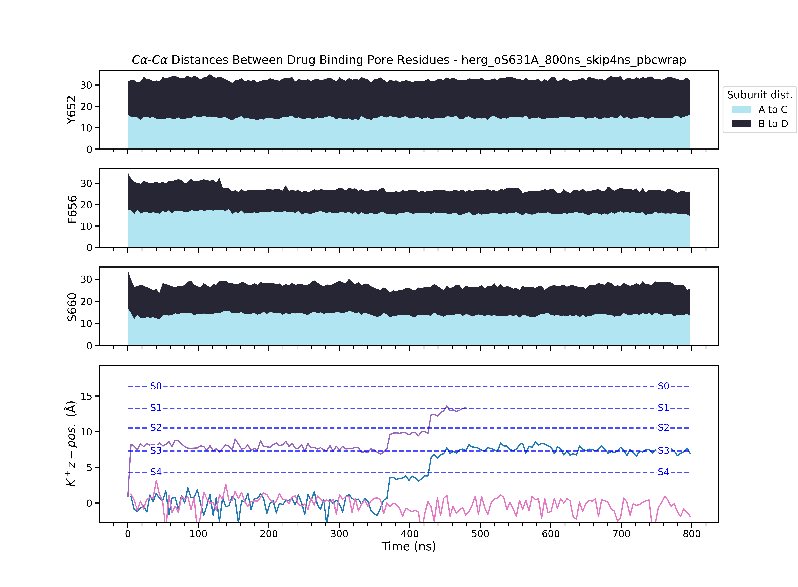
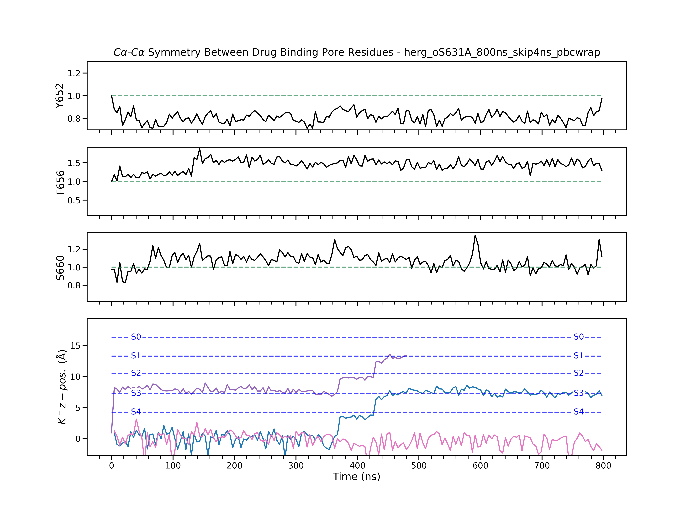
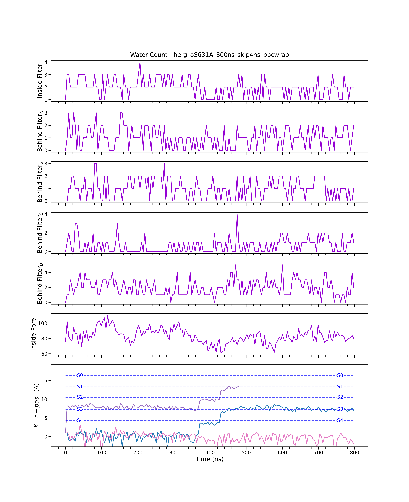

